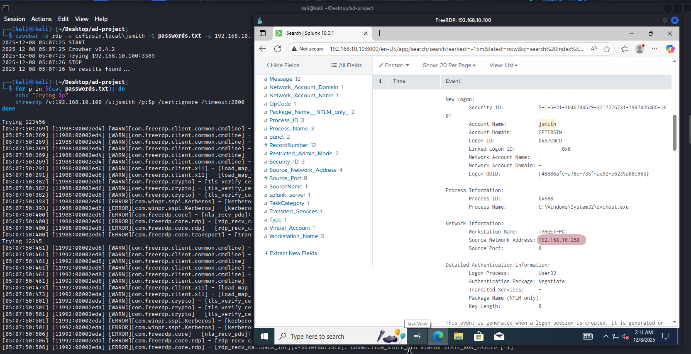

# Active Directory RDP Brute Force Attack & Splunk Detection

Bu proje, sanal bir Active Directory ortamında RDP Brute Force saldırısının simüle edilmesi ve Splunk SIEM aracı kullanılarak tespit edilmesini kapsamaktadır.

## Proje Amacı
Gerçek dünya senaryolarına uygun olarak; bir saldırganın Active Directory ortamına sızma girişimini analiz etmek ve bu girişimi log yönetimi (SIEM) ile nasıl görünür hale getirebileceğimizi deneyimlemek.

## Kullanılan Teknolojiler ve Mimari

| Bileşen | Teknoloji / Araç | Açıklama |
| :--- | :--- | :--- |
| **SIEM** | Splunk Enterprise | Log toplama, indeksleme ve görselleştirme. |
| **Saldırgan** | Kali Linux (xfreerdp & Bash Scripting) | Brute force saldırısını gerçekleştiren makine. |
| **Hedef** | Hedef: Windows 10/Server (Domain Member) | RDP servisi açık, saldırıya uğrayan makine. |
| **Log Agent** | Splunk Universal Forwarder | Windows loglarını Splunk'a iletir. |

## Uygulama Adımları

### 1. Saldırı Aşaması (Red Team)
Kali Linux üzerinden `xfreerdp` aracı kullanılarak hedef IP adresine (Örn: 192.168.10.100) saldırı başlatıldı.
```bash
# Kullanılan Örnek Komut
for p in $(cat passwords.txt); do
    echo "Trying $p"
    xfreerdp /v:192.168.10.100 /u:jsmith /p:$p /cert:ignore /timeout:2000
done
```
```
# Alternatif: Hydra ile Parola Kırma Örneği
# Bu komut, Kali Linux üzerinde popüler bir brute force aracı olan Hydra kullanılarak da gerçekleştirilebilir.
# hydra -L users.txt -P passwords.txt rdp://192.168.10.100 rdp -V

```




## 2. Tespit Aşaması (Blue Team)
Splunk arayüzünde Windows Security Logları incelendi. Özellikle EventCode=4625 (An account failed to log on) olaylarına odaklanıldı.

Saldırı trafiğini izlemek için öncelikle RDP başarısız girişlerine karşılık gelen Windows Event ID 4625'e odaklanıldı. Normalde dakikada tek tük görülen bu logların, saldırı anında yüzlerce kat artışı, tehdit göstergesidir.

Korelasyon Mantığı: Saldırıyı tespit etmek için kritik mantık, kısa bir zaman diliminde (örneğin 5 dakika) aynı kaynak IP adresinden gelen yüksek miktardaki ardışık 4625 olayını ilişkilendirmektir. Bu sorgu, bu korelasyonu gerçekleştirir.

Kullanılan SPL (Splunk Processing Language) Sorgusu:

```
index=windows sourcetype="WinEventLog:Security" EventCode=4625
| stats count by Source_Network_Address, Target_User_Name
| sort - count
```
---

### Loglama Odağı (Kritik Event ID'ler):


4625 (Audit Failure): Başarısız Oturum Açma denemelerini (Brute Force) takip etmek için kullanıldı.

4624 (Audit Success): Brute Force denemesi başarılı olsaydı, bu ID'yi arayarak yetkisiz başarılı girişi tespit edecektik.

## 3. Analiz Sonuçları

Kısa süre içerisinde tek bir kaynak IP adresinden (Kali Makinesi) yüzlerce başarısız giriş denemesi tespit edildi.

Saldırının hangi kullanıcı adlarına yönelik yapıldığı raporlandı [detaylı log görünümü](images/4625k.png).

Bu analizler, Windows Event Viewer'daki [başarısız giriş (Event 4625) loglarıyla](images/eventvwr.png) ve Kali Linux terminalindeki [başarılı brute force çıktısıyla](images/hydra.png) eşleştirilerek doğrulanmıştır.

## Gelecekteki Geliştirmeler (Next Steps)

1.  **Korelasyon Kuralı Geliştirme:** Splunk Enterprise Security (ES) veya basit bir Alarm kuralı yazarak, 5 saniye içinde aynı kaynaktan (192.168.10.250) gelen 10'dan fazla 4625 olayını otomatik olarak uyarı (alert) şeklinde tetiklemek.
2.  **Otomatik Engelleme (Active Response):** Saldırgan IP adresini tespit ettikten sonra, bu adresi Windows Güvenlik Duvarı'nda (Firewall) otomatik olarak engelleme (fail2ban benzeri) mekanizması entegre etmek.

## Ekran Görüntüleri

---

### Splunk ile Anomali Tespiti: 
Grafik, saldırı anında (Mon Dec 8, 2025) tek bir kaynak IP adresinden gelen başarısız oturum açma denemelerinin sayısının normalin çok üzerine çıktığını göstermektedir. Bu ani artış (spike), saldırının otomatik olarak tespit edildiğinin görsel kanıtıdır.


